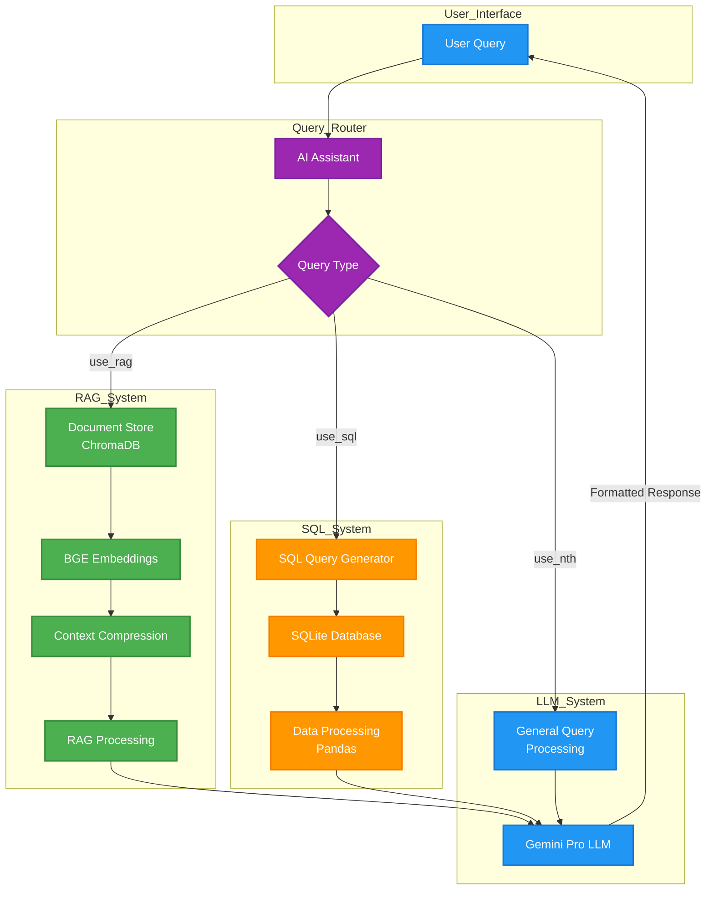

# Agentic Flight Information System

A sophisticated natural language processing system that intelligently routes and handles queries related to Tribhuvan International Airport services, flight bookings, and general aviation inquiries. The system employs a combination of RAG (Retrieval Augmented Generation), SQL querying, and general-purpose language models to provide accurate and contextual responses.

## System Architecture

The system consists of three main components that work together to provide comprehensive flight-related information:

1. **Query Router**: An AI assistant that categorizes incoming queries into three types:
   - RAG-based queries (Airport rules, regulations, and services)
   - SQL-based queries (Flight booking and scheduling)
   - General-purpose queries (Other aviation-related questions)

2. **RAG System**: Handles queries about Tribhuvan International Airport using a document retrieval system
3. **SQL Agent**: Processes flight booking queries using a SQLite database

[Previous sections remain the same until System Architecture]

## System Architecture

The system consists of three main components that work together to provide comprehensive flight-related information:

1. **Query Router**: An AI assistant that categorizes incoming queries into three types:
   - RAG-based queries (Airport rules, regulations, and services)
   - SQL-based queries (Flight booking and scheduling)
   - General-purpose queries (Other aviation-related questions)

2. **RAG System**: Handles queries about Tribhuvan International Airport using a document retrieval system
3. **SQL Agent**: Processes flight booking queries using a SQLite database

### System Architecture Diagram



The diagram above illustrates the complete flow of our system:

1. User queries enter through the interface layer
2. The Query Router (AI Assistant) analyzes and routes queries to the appropriate subsystem
3. Each subsystem (RAG, SQL, or General) processes the query using specialized components:
   - RAG System: Uses document store, embeddings, and context compression
   - SQL System: Generates queries, accesses database, and processes data
   - General System: Handles direct LLM processing
4. All paths converge at the Gemini Pro LLM for final response generation
5. Formatted responses are returned to the user

## Technologies Used

- Python 3.12.3
- LangChain
- Google Gemini Pro (ChatGoogleGenerativeAI)
- Hugging Face BGE Embeddings
- ChromaDB
- SQLite
- Pandas

## Setup and Installation

1. Clone the repository
2. Create a virtual environment:
```bash
python -m venv venv
source venv/bin/activate  # On Windows: venv\Scripts\activate
```

3. Install the required dependencies:
```bash
pip install -r requirements.txt
```

4. Set up your environment variables:
```bash
# Create a .env file with:
GEMINI_API_KEY=your_api_key_here
```

## System Components

### 1. AI Assistant Router
The system uses a prompt-based router to direct queries to the appropriate subsystem:

```python
ai_assistant_prompt = """
You are an AI assistant that responds strictly with a single word:
    * use_rag: For queries about airport rules, regulations, and services
    * use_sql: For flight booking related queries
    * use_nth: For general-purpose queries
"""
```

### 2. RAG System
Implements a retrieval-augmented generation system using:
- ChromaDB as the vector store
- BGE embeddings for document encoding
- Context compression for improved relevance

### 3. SQL Agent
Handles flight booking queries with:
- SQLite database for flight information
- Pandas for data processing
- Structured query generation and natural language responses

## Database Schema

The flight database contains the following columns:
- Airline Name
- From (Departure location)
- To (Arrival location)
- Estimated Time of Take Off
- Estimated Time of Arrival
- Type (Domestic/International)
- Death Rate (%)

## Usage Example

```python
user_query = "Give me the list of Airlines flying from Kathmandu to New Delhi"
decision = ai_assistant(ai_assistant_prompt, user_query, llm)

if decision == "use_rag":
    print(rag_assistant(rag_prompt, user_query, llm))
elif decision == "use_sql":
    print(sql_items_retrieval(sql_agent_prompt, user_query, llm, sql_prompt))
else:
    print(normal_query(user_query, llm))
```

## Features

- **Intelligent Query Routing**: Automatically determines the most appropriate subsystem to handle each query
- **Context-Aware Responses**: Uses document retrieval for accurate airport-specific information
- **Structured Flight Data**: Maintains a database of flight schedules and routes
- **Natural Language Processing**: Converts user queries into SQL and provides human-readable responses
- **Flexible Architecture**: Easily extensible for additional functionality

## Response Formats

The system provides responses in different formats depending on the query type:

1. **Flight Booking Queries**:
   ```
   There is a flight from Kathmandu to New Delhi operated by Nepal Airlines.
   - Estimated Time of Take Off: 08:00
   - Estimated Time of Arrival: 09:30
   - Type: International
   - Death Rate: 0.01%
   ```

2. **Airport Information**: Detailed responses based on retrieved documents
3. **General Queries**: Direct answers using the language model


## Acknowledgments

- Google Gemini Pro for the language model
- BAAI for the BGE embeddings
- The LangChain community for the framework
